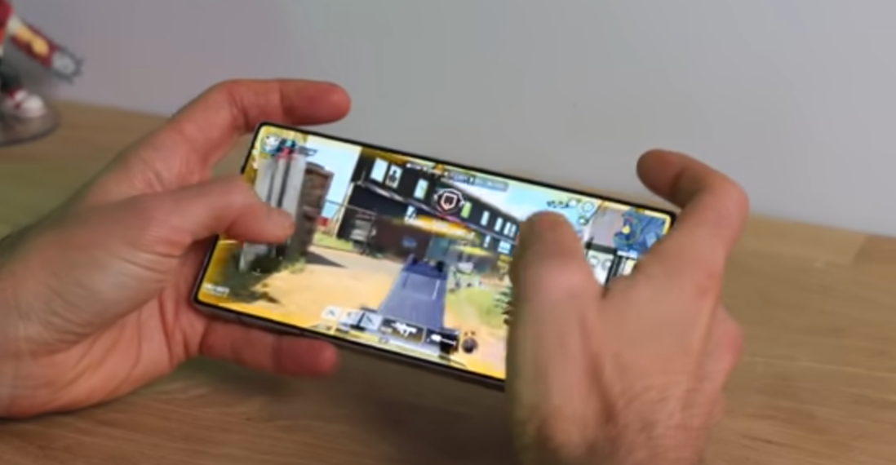
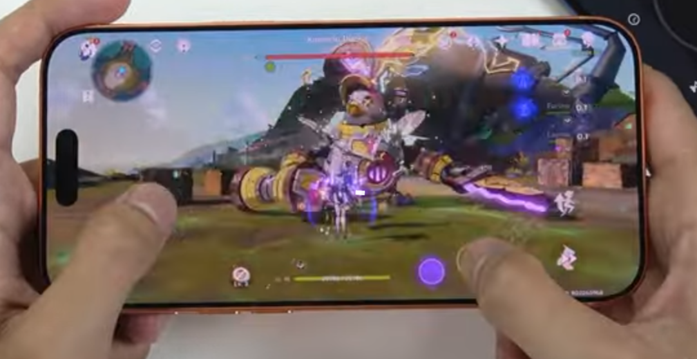
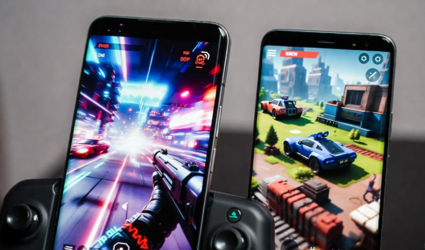

# The Apex of Mobile Performance: 2025 Gaming Phone Guide

In the competitive landscape of *Call of Duty Mobile*, *PUBG Mobile*, and the visually demanding *Genshin Impact*, your smartphone is no longer just a communication tool — it is a competitive weapon.

By late 2025, the gap between a typical “flagship” phone and a true **gaming-focused device** has widened dramatically. Raw processing power alone is no longer enough. What separates winners from frustration is **sustained thermal performance**, **ultra-low touch latency**, and **deep software optimization** tailored for long gaming sessions.

This guide breaks down which phones actually dominate when matches last longer than marketing benchmarks.

> **Testing context:**  
> Performance observations in this guide assume maximum in-game graphics settings, high refresh-rate modes where available, and extended gameplay sessions exceeding 90 minutes under warm ambient conditions typical of real-world use.

---

## 1. The Undisputed King: ASUS ROG Phone 9 Pro

The ROG Phone 9 Pro is not a traditional smartphone trying to be good at games — it is a dedicated gaming device that happens to make calls. ASUS fully embraces its gaming DNA, pairing aggressive hardware design with the **Snapdragon 8 Elite** platform.

### Performance in the Field

**Call of Duty Mobile**  
The ROG Phone 9 Pro supports high-refresh gameplay modes up to 144Hz where enabled by the game engine. When combined with **AirTriggers 7** — ultrasonic shoulder controls built into the frame — players can adopt advanced control layouts without blocking the display. This dramatically improves movement, aiming, and firing speed in competitive matches.

**PUBG Mobile**  
With extremely high touch sampling rates and finely tuned latency control, swipe-based aiming and camera adjustments feel instantaneous. In long-range engagements, this responsiveness translates into more consistent tracking and faster reaction windows.

**Genshin Impact**  
Genshin remains one of the toughest stress tests for mobile hardware. The ROG Phone 9 Pro is among the few devices capable of maintaining near-locked 60 FPS in dense environments and effects-heavy combat for extended sessions. The key factor is its external **AeroActive Cooler 9**, which uses active cooling technology to significantly reduce surface and internal temperatures during sustained load.

---

## 2. The Raw Power Specialist: RedMagic 11 Pro

If the ROG Phone is a precision-engineered performance machine, the RedMagic 11 Pro is a purpose-built powerhouse that prioritizes cooling and screen immersion above all else.

### Why It Excels in PUBG Mobile

The RedMagic 11 Pro features a true uninterrupted display by placing the front camera beneath the OLED panel. The result is a completely unobstructed field of view — a subtle but real advantage in *PUBG Mobile*, where spotting distant movement can decide a match.

**Active Cooling Advantage**  
An internal high-speed fan actively expels heat from the chipset area. This allows the phone to maintain peak brightness and performance longer than passively cooled devices, avoiding the aggressive thermal dimming seen on many mainstream flagships during long matches.

**Gaming-Centric Software**  
RedMagic’s Game Space environment allows per-game tuning of CPU, GPU, touch sensitivity, and even macro behavior. While not as polished as iOS, it offers unmatched control for players who like to fine-tune every variable.

---

## 3. The Optimization Titan: iPhone 17 Pro Max

Apple continues to take a fundamentally different approach. Rather than chasing extreme hardware additions, the iPhone 17 Pro Max relies on the efficiency of the **A19 Pro** chip and Apple’s tightly controlled software ecosystem.

### The Genshin Impact Experience

*Genshin Impact* is heavily optimized for iOS, and it shows. On the iPhone 17 Pro Max, players benefit from advanced rendering techniques such as **MetalFX Upscaling**, which intelligently balances visual quality and thermal output by rendering internally at lower resolutions and scaling efficiently.

**Consistency Over Peaks**  
While some Android devices may achieve higher momentary frame rates, the iPhone’s real strength is frame-time stability. Gameplay remains smooth with minimal stutter — an often overlooked factor that matters greatly during fast-paced encounters in *Call of Duty Mobile*.

**Audio Latency and Awareness**  
For competitive *PUBG Mobile* players, audio cues are critical. Apple’s tight integration between hardware, OS, and wireless audio reduces latency, allowing footsteps and gunfire to be perceived closer to real-time.

---

## Technical Comparison Overview

| Feature | ASUS ROG Phone 9 Pro | RedMagic 11 Pro | iPhone 17 Pro Max |
|------|--------------------|----------------|------------------|
| Chipset | Snapdragon 8 Elite | Snapdragon 8 Elite | A19 Pro |
| Cooling | External active cooler | Internal active fan | Passive thermal design |
| Best For | CoD Mobile | PUBG Mobile | Genshin Impact |
| Touch Responsiveness | Extremely low | Extremely low | Very consistent |
| Battery Focus | Large, gaming-optimized | Large, endurance-focused | Efficiency-driven |

---

## Choosing the Right Phone Based on Your Game

### If You Play Call of Duty Mobile
Prioritize **control flexibility and touch responsiveness**. Shoulder triggers and customizable input layouts provide a tangible advantage in movement-heavy gunfights.

### If You Play PUBG Mobile
Prioritize **screen clarity and sustained brightness**. Long matches punish phones that overheat and dim aggressively. Active cooling can make the difference between seeing an enemy — or missing them entirely.

### If You Play Genshin Impact
Prioritize **GPU efficiency and long-term stability**. Genshin rewards devices that can maintain performance over hours, not minutes. Software optimization matters more than raw benchmarks here.

---

## Final Verdict

In 2025, the “best gaming phone” is no longer defined by RAM size or peak benchmark scores. True performance is measured by how well a device manages heat, input latency, and stability over time.

For players chasing the absolute competitive edge, the **ASUS ROG Phone 9 Pro** remains the gold standard. The **RedMagic 11 Pro** delivers unmatched value for raw, sustained power, while the **iPhone 17 Pro Max** continues to dominate in optimization-heavy titles like *Genshin Impact*.

Gaming phones are no longer niche — they are a category of their own.

---

## Frequently Asked Questions (FAQ)

### What is the best gaming phone in 2025 overall?
There is no single “best” phone for every gamer. In 2025, the best choice depends on the game you play most. Devices like the ASUS ROG Phone 9 Pro excel in competitive shooters due to dedicated gaming controls and aggressive cooling, while phones such as the iPhone 17 Pro Max stand out in optimization-heavy titles like *Genshin Impact* thanks to consistent frame pacing and efficient rendering.

---

### Are gaming phones better than flagship phones for long gaming sessions?
Yes, in most cases. Gaming phones are designed for **sustained performance**, not just short benchmark runs. Features like active cooling, larger batteries, and gaming-focused software allow them to maintain performance and screen brightness during long sessions, whereas many standard flagships reduce performance once thermal limits are reached.

---

### Does active cooling really make a difference in mobile gaming?
Active cooling plays a significant role in reducing thermal throttling. Phones with internal fans or external cooling accessories are better able to maintain stable frame rates and prevent screen dimming during extended gameplay. This is especially noticeable in long *PUBG Mobile* matches and open-world games like *Genshin Impact*.

---

### Is the iPhone still good for mobile gaming compared to Android gaming phones?
Absolutely. While iPhones do not use aggressive cooling hardware, Apple’s advantage lies in software and hardware optimization. Games such as *Genshin Impact* and *Call of Duty Mobile* are often more stable on iOS, with smoother frame-time consistency, even if peak frame rates may be lower than on specialized Android gaming phones.

---

### What matters more for gaming: high refresh rate or touch sampling rate?
Both matter, but they affect different aspects of gameplay. High refresh rates improve visual smoothness, while high touch sampling rates reduce input delay. Competitive shooter players tend to benefit more from low input latency, whereas fast-paced action games feel smoother on high-refresh displays. The best gaming phones balance both.

---

### Can mobile games really run at stable 60 FPS for hours?
Under the right conditions, yes. Stability depends on the game, graphics settings, ambient temperature, and cooling design of the phone. Gaming-focused devices are better equipped to maintain near-stable performance over long sessions, while general-purpose flagships may gradually reduce frame rates to manage heat.

---

### Are shoulder triggers and gaming accessories worth it?
For competitive players, they can provide a real advantage. Shoulder triggers allow more complex control layouts without blocking the screen, making movement and aiming more efficient in shooters like *Call of Duty Mobile*. Casual players may not need them, but serious competitors often prefer them.

---

### Which game is the most demanding on mobile hardware in 2025?
*Genshin Impact* remains one of the most demanding mainstream mobile games due to its open world, real-time lighting, and heavy GPU usage. It is often used as a benchmark for sustained mobile performance and thermal efficiency.

---

### Do more RAM and bigger batteries guarantee better gaming performance?
Not necessarily. While sufficient RAM and battery capacity help, gaming performance is more strongly influenced by chipset efficiency, thermal design, and software optimization. A well-optimized phone with balanced hardware often outperforms a device with higher raw specs but poor thermal management.

---

### Is a gaming phone worth buying if I don’t play competitively?
If you play occasionally or casually, a regular flagship phone may be enough. Gaming phones are best suited for players who spend long hours in demanding titles, care about stable performance, and want features specifically designed for gaming comfort and control.

---
