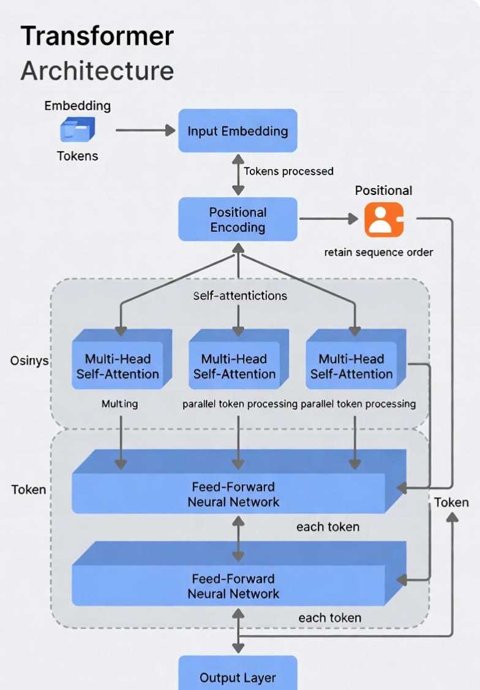
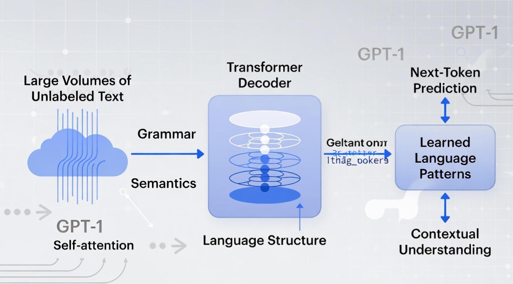
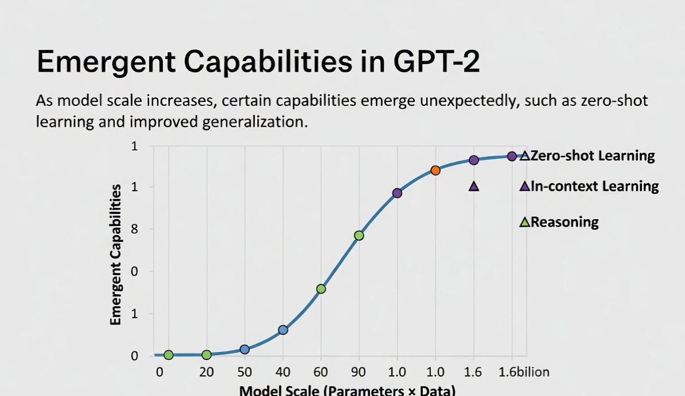
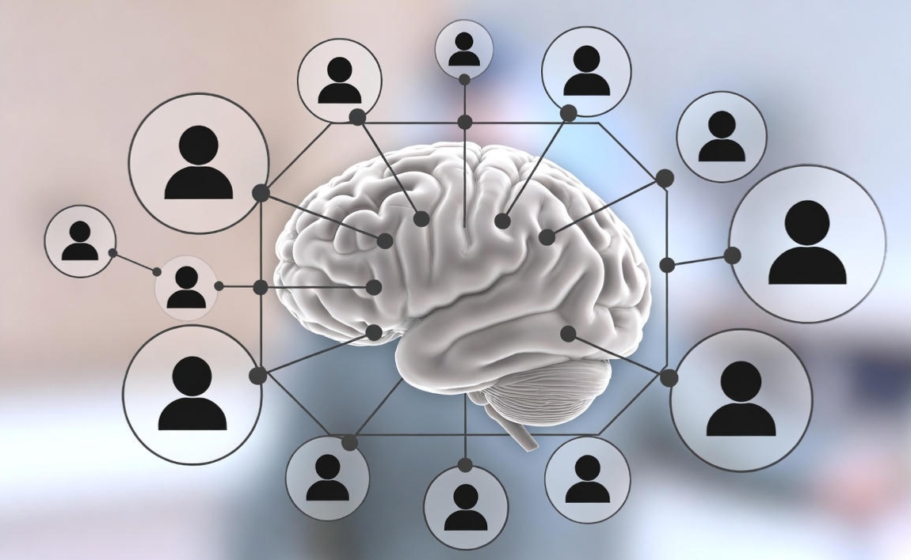
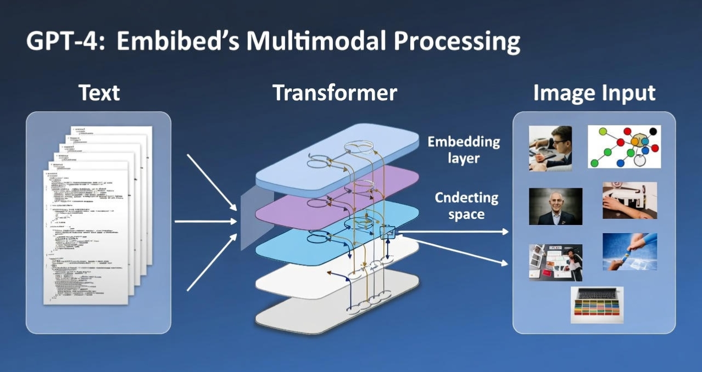
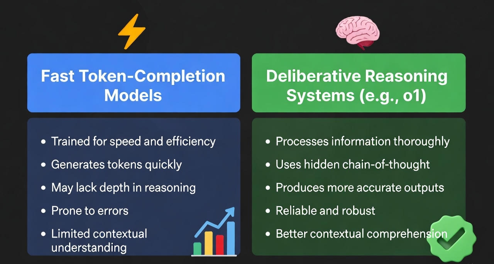

# The Architectures of Intelligence: A Deep Dive into the Evolution of GPT (2018–2025)

## Introduction: From Language Prediction to Machine Reasoning

In less than a decade, the Generative Pre-trained Transformer (GPT) series has evolved from a modest research experiment into one of the most influential technologies of the modern era. What began as a simple language model trained to predict the next word has gradually transformed into a multimodal reasoning system capable of analysis, planning, and complex problem-solving.

This article traces the architectural, conceptual, and socio-technical evolution of GPT — not as a product timeline, but as a story of how **scale, data, and alignment reshaped intelligence itself**.

---

## 1. The Pre-Transformer Era: The Sequential Bottleneck

Before 2017, Natural Language Processing (NLP) was dominated by **Recurrent Neural Networks (RNNs)** and **Long Short-Term Memory (LSTM)** models. These architectures processed language sequentially — one token at a time — which introduced two major limitations:

1. **Vanishing and exploding gradients**, causing models to lose long-range context.
2. **Computational inefficiency**, as sequential processing prevented effective GPU parallelization.

The breakthrough arrived with the 2017 paper *“Attention Is All You Need”*, which introduced the **Transformer architecture**. By replacing recurrence with **self-attention**, transformers allowed models to evaluate relationships between all tokens simultaneously, fundamentally redefining how machines understand context.

---

## 2. GPT-1 (2018): The Generative Pre-Training Hypothesis

OpenAI’s first GPT model demonstrated a radical idea: **language understanding could emerge from next-token prediction alone**.

- **Parameters:** 117 million  
- **Training data:** BookCorpus (≈7,000 unpublished books)

Instead of task-specific supervision, GPT-1 was pre-trained on raw text and fine-tuned minimally. The result was a model that implicitly learned grammar, semantics, and narrative structure — without being explicitly taught linguistic rules.

This work laid the foundation for modern large language models.

---

## 3. GPT-2 (2019): Scale and Emergent Behavior

GPT-2 scaled the same architecture to **1.5 billion parameters**, revealing something unexpected: **capabilities began to emerge without explicit training**.

Key developments:
- Zero-shot task performance
- Coherent long-form text generation
- General-purpose adaptability

This gave rise to the **Scaling Hypothesis** — the observation that increasing model size, data, and compute reliably produces new qualitative abilities. GPT-2 also sparked public debate when OpenAI initially delayed its release due to concerns about misuse.

---

## 4. GPT-3 (2020): In-Context Learning and Prompting

With **175 billion parameters**, GPT-3 marked a paradigm shift in how humans interact with AI.

### In-Context Learning
Rather than fine-tuning, users discovered that GPT-3 could adapt simply by reading examples placed directly in the prompt. This behavior — later termed *in-context learning* — eliminated the need for task-specific retraining.

### The Internet as a Dataset
Trained largely on Common Crawl, GPT-3 absorbed an unprecedented breadth of human knowledge. However, this also meant inheriting biases, inaccuracies, and hallucinations, since the model optimized for **plausible continuation**, not truth.

---

## 5. InstructGPT (2022): The Alignment Breakthrough

As models grew larger, it became clear that raw intelligence was not enough. GPT-3 often ignored instructions or produced unhelpful responses.

The solution was **Reinforcement Learning from Human Feedback (RLHF)**:
1. Humans ranked multiple model outputs
2. A reward model learned these preferences
3. The language model was optimized to align with human intent

This shift transformed GPT from a text generator into a **useful assistant** — directly leading to the launch of ChatGPT.

---

## 6. GPT-4 (2023): Multimodality and Reasoning

GPT-4 introduced a qualitative leap rather than a simple scale increase.

Key advancements:
- Multimodal inputs (text + images)
- Improved logical reasoning
- Strong performance on professional benchmarks

While OpenAI did not disclose the architecture, GPT-4 is widely believed to use a **Mixture-of-Experts (MoE)** design, enabling efficient scaling without activating all parameters simultaneously.

---

## 7. GPT-4o and o1 (2024–2025): Toward Deliberative Intelligence

Recent models reflect a shift from **fast statistical responses** to **deliberative reasoning systems**.

### GPT-4o (Omni)
- Unified text, vision, and audio
- Low-latency, real-time interaction
- Emotionally expressive speech synthesis

### OpenAI o1 Series
- Internal reasoning and self-correction
- Hidden chain-of-thought deliberation
- Strong performance on complex math, logic, and coding tasks

Rather than exposing reasoning directly, these models use **private deliberation tokens** to improve accuracy and reliability.

---

## 8. Socio-Technical Impact and the Road Ahead

The GPT lineage represents a shift from **software as tools** to **AI as agents** — systems capable of planning, executing, and adapting over extended time horizons.

### Key Challenges Ahead
- Diminishing returns from raw data
- Rising energy and compute costs
- Alignment, safety, and governance

Future progress is likely to rely on:
- Synthetic and curated data
- More efficient architectures
- Embodied and agentic AI systems interacting with the physical world

---

## Summary: GPT at a Glance

| Model | Year | Parameters | Core Innovation |
|-----|------|------------|----------------|
| GPT-1 | 2018 | 117M | Generative Pre-training |
| GPT-2 | 2019 | 1.5B | Emergent Zero-Shot Learning |
| GPT-3 | 2020 | 175B | In-Context Learning |
| InstructGPT | 2022 | 175B | Human Alignment (RLHF) |
| GPT-4 | 2023 | Undisclosed (MoE) | Multimodality & Reasoning |
| GPT-o1 | 2024 | Undisclosed | Deliberative Intelligence |

---

## Conclusion: Beyond Context, Toward Agency

The evolution of GPT demonstrates that intelligence is not hard-coded — it **emerges** when scale, architecture, and feedback align. Transformers solved context. Scaling unlocked capability. Alignment created usefulness.

The next frontier is not merely smarter models, but **autonomous systems** capable of pursuing long-term goals responsibly. Whether this leads to Artificial General Intelligence remains uncertain — but the architectural foundations are already in place.
## Frequently Asked Questions (FAQ)

### What is GPT and how does it work?
GPT (Generative Pre-trained Transformer) is a type of large language model that predicts the next token in a sequence based on context. It is built on the Transformer architecture, which uses self-attention to evaluate relationships between all tokens simultaneously, allowing the model to understand long-range dependencies in language.

---

### Why are Transformers better than RNNs and LSTMs?
Transformers process entire sequences in parallel rather than sequentially. This eliminates the vanishing gradient problem common in RNNs and enables efficient GPU acceleration, making it possible to train extremely large models like GPT-3 and GPT-4.

---

### What does “Generative Pre-training” mean?
Generative pre-training refers to training a model on large amounts of unlabeled text using a next-token prediction objective. Instead of learning specific tasks, the model learns general language structure, which can later be adapted to many tasks through prompting or minimal fine-tuning.

---

### What is the Scaling Hypothesis in large language models?
The scaling hypothesis suggests that increasing model size, training data, and compute leads to predictable improvements in performance and the emergence of new capabilities, such as zero-shot learning and complex reasoning, without explicit task-specific training.

---

### What is in-context learning?
In-context learning is the ability of a language model to perform a task by reading examples directly in the prompt, without updating its internal parameters. GPT-3 demonstrated this capability at scale, changing how humans interact with AI systems.

---

### Why do large language models hallucinate?
Hallucinations occur because language models are optimized to generate plausible continuations, not to verify factual correctness. When the training data is ambiguous or incomplete, the model may confidently generate incorrect information that statistically fits the context.

---

### What is RLHF and why is it important?
Reinforcement Learning from Human Feedback (RLHF) is a training method where human evaluators rank model outputs. These rankings train a reward model that helps align the AI’s behavior with human expectations, making responses more helpful, safe, and instruction-following.

---

### How is GPT-4 different from GPT-3?
GPT-4 introduced stronger reasoning abilities, improved reliability, and multimodal inputs, allowing it to process both text and images. While GPT-3 focused on language generation, GPT-4 demonstrated more structured problem-solving and professional-level performance across many tasks.

---

### What does “multimodal AI” mean?
Multimodal AI systems can process and reason across multiple input types such as text, images, audio, and video. GPT-4 and GPT-4o represent a shift toward unified models that understand the world beyond text alone.

---

### What is GPT-4o and how is it different from GPT-4?
GPT-4o (Omni) is designed for real-time interaction, combining text, vision, and audio into a single model. It reduces latency significantly and enables natural voice conversations with emotional and contextual awareness.

---

### What is the OpenAI o1 model series?
The o1 series focuses on deliberative reasoning. These models internally reason through complex problems using hidden chain-of-thought processes, allowing them to solve advanced math, logic, and coding tasks more reliably than earlier models.

---

### Does GPT actually “think” or understand?
GPT does not think or understand in a human sense. Its reasoning abilities emerge from statistical pattern recognition at scale. However, the behaviors it exhibits—planning, reasoning, and self-correction—can closely resemble human cognitive processes.

---

### Is GPT moving toward Artificial General Intelligence (AGI)?
GPT represents progress toward more general-purpose intelligence, but it is not AGI. Current models lack persistent memory, embodied experience, and autonomous goal-setting. Whether scaling and architectural improvements alone can achieve AGI remains an open research question.

---

### What are the biggest limitations of current GPT models?
Key limitations include hallucinations, dependence on training data quality, high computational costs, and challenges in long-term autonomy and alignment. These constraints shape the direction of future research.

---

### What is the future of GPT and large language models?
Future development is likely to focus on efficiency, reasoning reliability, synthetic data, agentic behavior, and embodied AI. The goal is not just smarter models, but systems that can act responsibly over extended time horizons.
