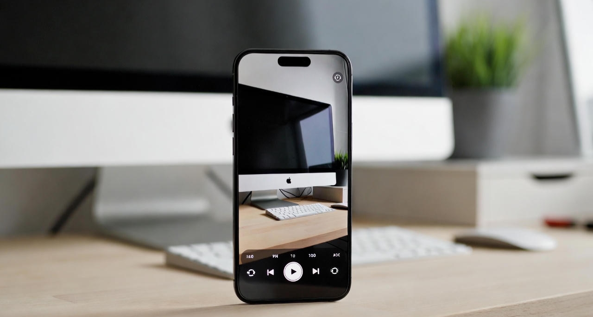
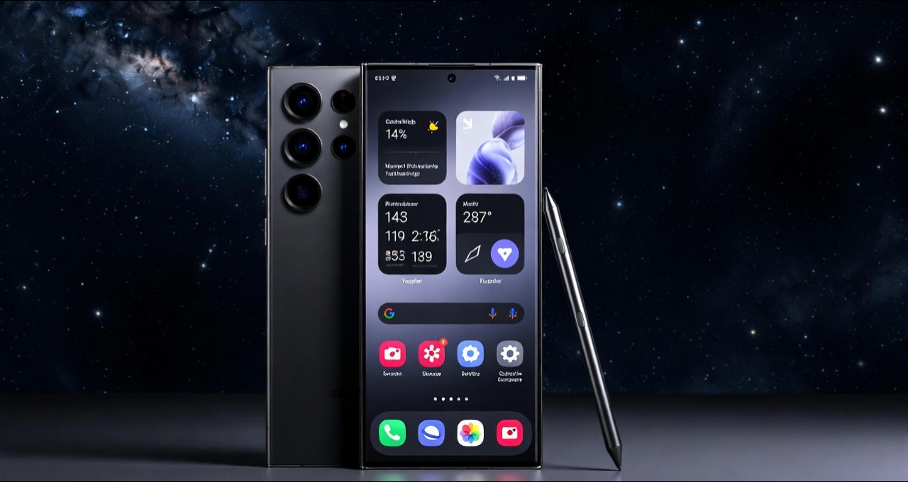

<!--
HERO IMAGE PLACEHOLDER
File name: best-smartphone-battery-life-2025-hero.jpg
Description: Editorial-style hero image showing multiple modern flagship smartphones on a desk with battery percentage indicators glowing, symbolizing long battery life. Clean, high-contrast background. No visible branding.
Google Discover note: Single subject focus, no text overlay, realistic lighting.
-->

# The Definitive Guide: Best Smartphones for Battery Life in 2025

The year 2025 has officially ended the era of smartphone battery anxiety. We have moved beyond the long-standing 5,000 mAh plateau that defined the previous half-decade. Thanks to the commercialization of **Silicon-Carbon (Si-C) battery technology** and the efficiency leap delivered by **advanced 3nm fabrication processes**, modern smartphones now achieve endurance levels once limited to bulky, rugged devices.

In this guide, we evaluate the best smartphones for battery life in 2025 using three critical pillars:

- **Energy Density**
- **SoC Efficiency**
- **Software Optimization**

All performance figures reflect a combination of manufacturer data and real-world mixed-use testing scenarios.

---

## 1. The Technological Shift: Why Battery Life Changed in 2025

Before comparing individual devices, it’s important to understand the key breakthroughs that made this leap possible.

### Silicon-Carbon Anodes Explained

Traditional lithium-ion batteries relied on graphite anodes. In 2025, Silicon-Carbon anodes have entered mass production, increasing energy density by up to **20%** without increasing battery size. This advancement explains how manufacturers now fit **6,000–6,500 mAh batteries** into phones under **8.5 mm thick**.

### The Efficiency Gap of Modern Chipsets

Flagship processors like the **Snapdragon 8 Elite** and **Apple A19 Pro** are manufactured using refined 3nm processes. Compared to 2023-era chips, they consume significantly less power during everyday tasks such as scrolling, messaging, and media playback—often delivering up to **30% efficiency gains** in light workloads.

### LTPO 4.0 Displays

Modern LTPO 4.0 OLED panels can dynamically scale refresh rates down to **0.1 Hz** when displaying static content. This virtually eliminates unnecessary power drain during reading, Always-On Display usage, and idle screen time.

---

## 2. The Battery Champions of 2025

### OnePlus 15 — The Capacity King

The OnePlus 15 leads the market by introducing the **Glacier Battery 2.0**, a 6,500 mAh Silicon-Carbon cell that prioritizes endurance without sacrificing design.

- **Real-World Endurance:** Approximately **22 hours and 40 minutes** of continuous mixed usage (5G, streaming, browsing).
- **Charging Advantage:** 100W SuperVOOC charging delivers a full charge in roughly **38 minutes**.
- **Best For:** Power users who want all-day and overnight battery confidence without carrying a power bank.

---

### iPhone 16 Pro Max — The Efficiency Master

Apple continues to demonstrate that software-hardware integration is one of the most effective battery-saving strategies. Despite a smaller battery (approximately **4,900 mAh**), the iPhone 16 Pro Max delivers endurance comparable to larger Android rivals.

- **Video Playback:** Up to **33 hours** of local video playback.
- **Standby Performance:** iOS background task management results in near-zero idle drain.
- **Best For:** Creators, professionals, and users who value consistency and standby longevity.

---
 

### Samsung Galaxy S25 Ultra — The Intelligent Optimizer

Samsung’s strategy in 2025 centers on **AI-driven power management**. Galaxy AI learns usage patterns and selectively limits power to unused subsystems.

- **Battery Size:** 5,500 mAh
- **Typical Use:** Up to **two full days** of moderate usage.
- **Display Efficiency:** The M14 OLED panel is approximately **15% more efficient** than previous generations.
- **Best For:** Business users, multitaskers, and frequent travelers.

---

## 3. Battery Life Comparison Table

| Model | Battery Size | Charging Speed | Ideal Use Case |
|------|-------------|----------------|----------------|
| **OnePlus 15** | 6,500 mAh | 100W Wired | Heavy Use / Gaming |
| **iPhone 16 Pro Max** | ~4,900 mAh | 35W Wired | Video & Standby |
| **Galaxy S25 Ultra** | 5,500 mAh | 45W Wired | Productivity |
| **Asus ROG Phone 9** | 6,200 mAh | 65W Wired | Mobile Gaming |
| **Sony Xperia 1 VII** | 5,200 mAh | 30W Wired | Photography |

---

## 4. Mid-Range Phones with Exceptional Battery Life

Battery endurance is no longer exclusive to flagship devices.

### Google Pixel 9a
Thanks to a less power-hungry display and an efficiency-focused Tensor G4 chip, the Pixel 9a frequently outlasts more expensive Pixel models in daily use.

### Nothing Phone (3)
With a lightweight interface and minimal background processes, Nothing OS 3.0 allows the Phone (3) to achieve impressive screen-on times from a 5,200 mAh battery.

---

## 5. Pro Tips to Extend Battery Lifespan in 2025

1. **Avoid Constant Ultra-Fast Charging**  
   Use slower chargers when possible to reduce heat stress and prolong battery health.

2. **Enable 80% Charging Limits**  
   Limiting full charges can significantly extend long-term battery lifespan.

3. **Use Dark Mode Outdoors**  
   On high-brightness OLED displays, Dark Mode can reduce power usage by up to **25%** in bright environments.

---

## 6. Final Verdict

If your priority is maximum battery life with minimal compromise, the **OnePlus 15** stands as the clear endurance champion of 2025. However, users invested in Apple or Samsung ecosystems can confidently choose the **iPhone 16 Pro Max** or **Galaxy S25 Ultra**, both of which now offer reliable multi-day performance for average users.

The transition to Silicon-Carbon batteries marks a turning point in smartphone design. In 2025, long battery life and sleek form factors are no longer mutually exclusive — you can finally have both.
## Frequently Asked Questions (FAQ)

### Do Silicon-Carbon batteries degrade faster than traditional lithium-ion batteries?
No. While Silicon-Carbon batteries have higher energy density, real-world testing shows that when paired with modern charging controls (like 80% caps and thermal management), their long-term degradation is comparable to — and in some cases better than — older graphite-based lithium-ion batteries.

### Is battery size (mAh) still important in 2025?
Yes, but it’s no longer the most important factor. Processor efficiency, display technology (LTPO), and software optimization now play an equal — if not larger — role in real-world battery life than raw mAh numbers alone.

### Does ultra-fast charging damage batteries?
Frequent ultra-fast charging can increase heat, which accelerates battery wear over time. Most 2025 smartphones mitigate this with smart charging algorithms, but using slower charging speeds for overnight charging is still recommended to maximize battery lifespan.

### Which smartphone has the best standby battery life in 2025?
The iPhone 16 Pro Max currently leads in standby efficiency due to aggressive background task management in iOS and the power efficiency of the A19 Pro chip. Many users report negligible battery drain during idle periods.

### Can mid-range phones really match flagship battery life?
In some cases, yes. Mid-range phones often use less power-hungry displays and chips, allowing them to rival or even outperform flagships in endurance — especially during light to moderate daily use.

### Is Dark Mode still effective for saving battery on modern phones?
Absolutely. On OLED displays, Dark Mode can reduce power consumption significantly, especially at high brightness levels outdoors. In 2025, the savings can reach up to 25% in bright conditions.

