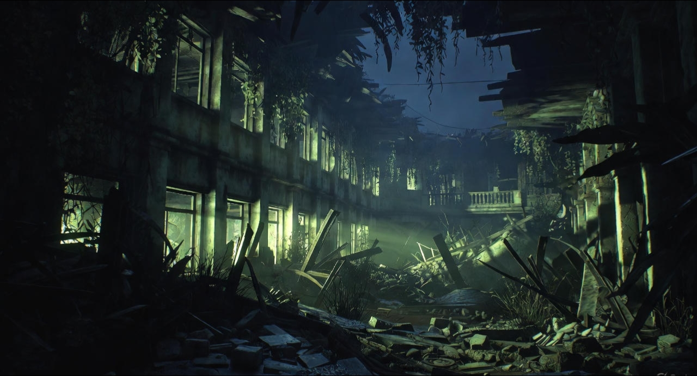

## Introduction: Why 2026 Is a Defining Year for Gaming

Every console generation reaches a point where ambition and technology finally align. For the PlayStation 5 and Xbox Series X era, **that moment arrives in 2026**.

The early 2020s were defined by compromise. Developers were still supporting aging hardware, global supply shortages delayed adoption, and many engines were not yet optimized for SSD-first workflows. While the promise of next-generation gaming was visible, it was rarely realized.

By 2026, those constraints are gone.

Studios are now designing games around fast NVMe storage, modern CPUs, real-time physics simulation, and persistent world systems. This shift represents more than visual improvement—it marks a fundamental change in how games are built and experienced.

---

## The Architectural Shift: The End of Cross-Generation Design

From 2020 to 2024, cross-generation development slowed innovation. Games were required to function on PlayStation 4 and Xbox One hardware, forcing developers to limit AI complexity, segment worlds, and rely on frequent loading screens.

That era is now effectively over.

By 2026, modern game design is defined by:

- SSD-first world streaming  
- Persistent NPC behavior independent of player presence  
- Increased CPU headroom for AI and simulation  
- Physics-driven interaction replacing scripted animation  

Games no longer pause when the player looks away. Systems continue running, evolving, and reacting dynamically.

**2026 is the year games stop feeling like software and start feeling like places.**

---

## 1. Grand Theft Auto VI: A Living Simulation of Society

**Developer:** Rockstar Games  
**Confirmed Release Window:** 2026  
**Platforms:** PlayStation 5, Xbox Series X|S

For more than a decade, *Grand Theft Auto V* defined open-world design. With *Grand Theft Auto VI*, Rockstar aims to move beyond scale toward **systemic realism**.

Set in the fictional state of **Leonida**, a stylized reflection of modern Florida, GTA VI is built as an interconnected simulation. Traffic systems, law enforcement, social media, weather, and economic activity influence one another in real time.

### Dual Protagonists and Relationship-Driven Gameplay

Rockstar has confirmed a dual-protagonist structure featuring **Lucia** and her partner. Unlike previous multi-character designs, industry analysis suggests their relationship plays a functional role in gameplay.

Based on Rockstar’s historical design philosophy, player choices may influence:

- Character trust and cooperation  
- Dialogue tone and availability  
- Mission strategies and outcomes  

Rather than scripted storytelling alone, GTA VI leans into **emergent narrative**, allowing systems to shape the experience.

### RAGE Engine and Persistent Worlds

Rockstar’s proprietary RAGE engine continues to evolve alongside modern hardware. Developers familiar with the engine suggest a strong emphasis on world persistence—where player actions create lasting changes.

Possible implementations include:

- Environmental damage that persists over time  
- NPC routines adapting to player behavior  
- World states influenced by weather and economic shifts  

While specific mechanics remain unconfirmed, the intent is clear: GTA VI is designed to feel like a functioning ecosystem rather than a resettable sandbox.

---

## 2. Resident Evil 9: Survival Horror Reclaimed

**Developer:** Capcom  
**Release Year:** 2026  
**Engine:** RE Engine

Capcom’s resurgence over the past decade has redefined survival horror. *Resident Evil 9* represents the studio’s most refined expression of fear-driven design.

### Open-Zone Horror and Environmental Threats

Instead of a fully open world, RE9 is expected to use **open-zone environments**—large, interconnected areas designed for tension and resource management.

Environmental systems play a central role:

- Sound propagation alerts enemies  
- Environmental damage alters escape routes  
- Lighting and weather affect enemy behavior  

Fear is not scripted—it emerges from player decisions and environmental response.

### Grounded Body Horror

Capcom continues to emphasize biological realism over supernatural spectacle. Enemy design focuses on mutation, decay, and anatomical distortion, reinforcing a sense of physical vulnerability.

This approach restores survival horror to its roots, where fear is sustained rather than escalated.

---

## 3. Nintendo Switch 2: A Quiet Reinvention

**Platform:** Nintendo Switch 2  
**Launch Window:** 2026

Nintendo’s next-generation console does not compete on raw power. Instead, it focuses on efficiency, modern APIs, and intelligent rendering techniques.

Industry analysis suggests the platform prioritizes:

- AI-assisted upscaling  
- Faster internal storage  
- Improved CPU architecture for simulation-heavy games  

The result is competitive real-world performance, particularly in handheld mode.

### Pokémon’s Defining Opportunity

A Pokémon title built exclusively for Switch 2 represents a long-overdue evolution for the franchise.

Expected improvements include:

- Seamless open-world traversal  
- Stable frame rates  
- Visual fidelity aligned with the series’ art direction  

For the first time in years, Pokémon has the hardware foundation it needs.

---

## 4. 007 First Light: Social Stealth Redefined

**Developer:** IO Interactive  
**Release Year:** 2026

IO Interactive’s experience with systemic sandbox design makes it uniquely suited for the James Bond franchise. *007 First Light* reframes espionage as **social manipulation rather than constant action**.

Gameplay emphasizes:

- Social engineering  
- Environmental storytelling  
- Player-driven problem solving  

Success depends on awareness, patience, and creativity—not brute force.

---

## The Rise of Intelligent Indie Games

While AAA studios push technical boundaries, indie developers in 2026 focus on **meaningful interaction**.

Key trends include:

- Physics-driven traversal systems  
- Minimalist, interpretive storytelling  
- Cooperative mechanics built around trust  

These games may not dominate sales charts, but they continue to shape the creative direction of the medium.

---

## Frequently Asked Questions

### Why is 2026 considered a turning point for gaming?
Because it marks the end of cross-generation development and the full adoption of SSD-first, system-driven design.

### Are all mechanics discussed here confirmed?
Major titles and release windows are confirmed. Specific gameplay systems are discussed as informed analysis based on developer history and industry trends.

### Which platform benefits most from 2026?
Each platform benefits differently: PS5 and Xbox Series X gain deeper simulation, while Switch 2 benefits from architectural modernization.

---

## Final Thoughts: Games Designed to Be Lived In

2026 is not about spectacle alone—it is about confidence.

Developers are no longer apologizing for limitations. They are building worlds that assume intelligence, curiosity, and patience from the player.

The result is a medium that finally feels comfortable in its own skin—where games are not just played, but **inhabited**.

---

## Sources & Context

This article is based on official announcements, investor calls, developer interviews, and long-term observation of industry trends. Where speculation is present, it is framed as informed analysis rather than confirmed fact.
