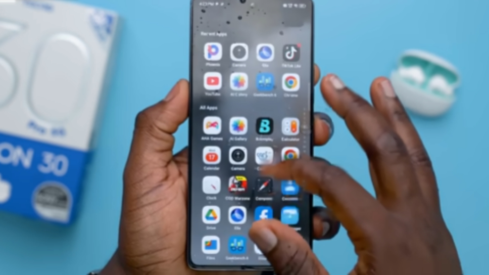
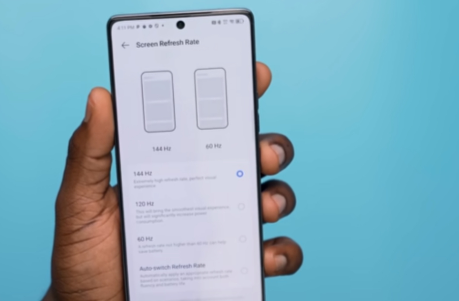
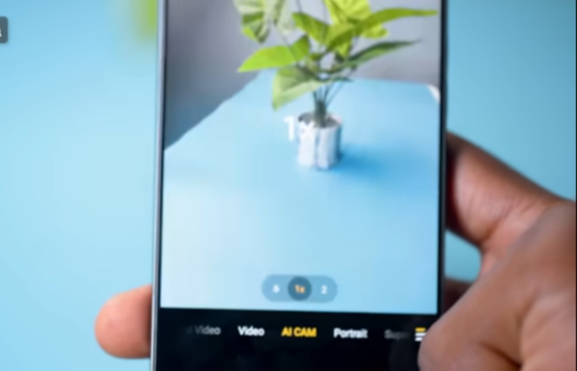

The midrange smartphone market has evolved dramatically. What was once a **“compromise zone”**—where buyers had to choose between performance, camera quality, or design—has become one of the most competitive battlegrounds in the industry.

Tecno, a brand historically associated with entry-level and budget devices, has spent the last few years **quietly but aggressively redefining its image**. With the Camon series in particular, Tecno has aimed squarely at creators, photographers, and power users who want near-flagship features without flagship pricing.

The **Tecno Camon 30 Pro** is the clearest expression of that ambition yet.

On paper, it looks almost too good for its class: a **Sony IMX890 flagship-grade camera sensor**, a **144Hz AMOLED display**, and the powerful **MediaTek Dimensity 8200 Ultimate** chipset. After **two weeks of daily use**, including gaming, photography, video recording, and regular productivity tasks, here’s a deep, honest breakdown of what this phone does right—and where it still falls short.

---

## Design & Build: A Camera-First Identity

Tecno calls this design language the **“Classic Side-Axis Camera Design”**, and the inspiration is obvious. The large circular camera module, combined with subtle detailing, takes cues from vintage rangefinder cameras rather than modern smartphone minimalism.

### Materials & In-Hand Feel

Instead of glass, Tecno uses what it calls **Tech-Art Leather** on the rear. In daily use, this turns out to be a smart decision:

- It resists fingerprints and smudges exceptionally well  
- It provides better grip than glossy glass backs  
- It feels warmer and more comfortable during long gaming sessions  

The frame itself is plastic, not metal, but it’s well-finished and sturdy enough that it doesn’t cheapen the experience.

### The Action Dot: More Than a Gimmick

One of the most distinctive features is the **Action Dot**—a small red LED next to the camera module. Unlike typical notification lights, this one is deeply integrated into the system.

It lights up during:
- Video recording (acting as a tally light)
- Charging and fast-charging states
- Incoming notifications
- Voice assistant activation

You can customize or disable these behaviors in settings, which helps the feature feel **intentional rather than flashy**.

---

## Display: 144Hz Where It Actually Matters

The Camon 30 Pro features a **6.78-inch AMOLED display** that punches far above what most people expect from a midrange device.

### Key Display Highlights

- **Refresh Rate:** 144Hz  
- **Panel Type:** AMOLED  
- **Eye Comfort:** High-frequency PWM dimming  
- **Color Profiles:** Vivid and Natural modes available  

The 144Hz refresh rate isn’t just a spec sheet flex. In daily use—scrolling, app switching, and gaming—it delivers a noticeably smoother experience than standard 120Hz panels.

Brightness levels are solid. While it doesn’t quite reach the peak brightness of ultra-premium flagships, the screen remains **perfectly legible under direct afternoon sunlight**, which is what matters in real-world usage.

Color tuning is another win. Out of the box, colors are punchy, but switching to the Natural profile results in a more accurate, balanced look suitable for photo and video editing.

---

## Camera Test: Sony IMX890 Doing Heavy Lifting

The **Camon** name has always been synonymous with camera performance, and the Camon 30 Pro fully embraces that identity.

### Main Camera: Sony IMX890 (50MP)

The star of the show is the **50MP Sony IMX890**, a **1/1.56-inch sensor with OIS**. This is the same sensor used in several upper-midrange and flagship devices from 2024 and 2025.

#### Daylight Performance
In good lighting, the camera produces:
- Excellent dynamic range  
- Strong contrast without crushing shadows  
- Natural color reproduction without excessive saturation  

HDR is reliable and consistent, preserving cloud detail while keeping foreground subjects properly exposed.

#### Low Light & Night Photography
This is where the Camon 30 Pro truly separates itself from most competitors in its price segment.

Thanks to optical image stabilization, the camera can hold longer shutter speeds without introducing blur. Night Mode processing is restrained and intelligent—images stay clean without turning skies into grainy blue noise.

In fact, I found myself **leaving Night Mode enabled by default**, something I rarely do on midrange phones.

### Video Capabilities (A Major Win)

- **4K 60fps on rear camera**
- **4K 60fps on front camera**
- Effective HDR video support
- Combined OIS + EIS stabilization

The ability to record **4K 60fps video on the selfie camera** is still rare even among expensive phones, making the Camon 30 Pro an excellent option for vloggers and content creators.

---

## Performance & Gaming: Dimensity 8200 Ultimate in Action

Under the hood is the **MediaTek Dimensity 8200 Ultimate**, a chipset positioned at the very top of the midrange tier.

### Benchmarks & Stability

In synthetic benchmarks like AnTuTu, the device consistently scores **above 900,000**, placing it firmly ahead of most Snapdragon 7-series competitors.

More importantly, performance is **stable**.

### Real-World Gaming Performance

| Game | Settings | Performance |
|-----|---------|-------------|
| PUBG Mobile | HDR / Extreme | Locked 60 FPS |
| Call of Duty: Mobile | Ultra | 90–120 FPS |
| Genshin Impact | Medium–High | 45–55 FPS (stable) |

The **9th-generation vapor chamber cooling system** keeps temperatures under control. After a 40-minute Genshin Impact session, the phone was warm but never uncomfortable, and throttling was minimal.

---

## Software Experience: HiOS 14 on Android 14

HiOS has historically been one of Tecno’s weakest points, but **HiOS 14** represents a noticeable improvement.

- Cleaner UI design  
- Reduced pre-installed apps compared to older versions  
- Useful AI tools like **AI Erase** and smart gallery search  
- Advanced customization for the Action Dot  

While some bloatware still exists, most of it can be disabled, and day-to-day performance is smooth and reliable.

---

## Battery Life & Charging

The **5000mAh battery** delivers consistent all-day endurance, even with the 144Hz refresh rate enabled.

### Charging Speeds (70W Ultra Charge)

- **0–50%:** ~16 minutes  
- **0–100%:** ~45–50 minutes  

Fast charging is included **in the box**, which is increasingly rare and very welcome.

---

## Final Verdict: Who Is the Camon 30 Pro For?

The **Tecno Camon 30 Pro** isn’t trying to be everything for everyone. Instead, it focuses on doing a few things exceptionally well—and succeeds.

### You should buy this phone if you care about:
- Mobile photography and night shots  
- Vlogging and front-camera video quality  
- Smooth high-refresh-rate gaming  
- A design that doesn’t look generic  

### Pros
- Flagship-grade Sony IMX890 camera sensor  
- 4K 60fps video on both front and rear cameras  
- Excellent 144Hz AMOLED display  
- Fast 70W charging included  

### Cons
- Plastic frame instead of metal  
- Some removable bloatware remains  
- No wireless charging  

**Bottom line:**  
The Camon 30 Pro confidently bridges the gap between *affordable* and *premium*, making it one of the strongest camera-focused midrange smartphones available right now.

---
## Frequently Asked Questions (FAQ)

### Is the Tecno Camon 30 Pro good for photography?
Yes. The Tecno Camon 30 Pro is one of the strongest camera-focused phones in its class. It features a **50MP Sony IMX890 sensor with Optical Image Stabilization (OIS)**, which is commonly used in higher-end devices. In real-world use, it delivers excellent dynamic range in daylight, reliable Night Mode results, and consistent sharpness in low-light scenes. For users who prioritize photography, this phone clearly stands out in the midrange segment.

---

### Does the Tecno Camon 30 Pro support 4K video recording?
Yes, and this is one of its biggest advantages. The Camon 30 Pro supports **4K video recording at 60fps on both the rear and front cameras**. This makes it especially appealing for vloggers, content creators, and social media users who rely heavily on selfie video quality—something many competitors still limit to 1080p.

---

### How good is the Tecno Camon 30 Pro for gaming?
The phone performs very well for gaming thanks to the **MediaTek Dimensity 8200 Ultimate chipset**. Popular titles like PUBG Mobile, Call of Duty: Mobile, and Genshin Impact run smoothly with stable frame rates. Combined with the **144Hz AMOLED display** and an effective vapor chamber cooling system, the gaming experience feels fluid without excessive overheating or aggressive thermal throttling.

---

### Does the Tecno Camon 30 Pro overheat during heavy use?
In extended gaming and camera use, the phone does get warm, but it stays within comfortable limits. Tecno’s **9th-generation vapor chamber cooling system** does a solid job of managing heat. During long gaming sessions, performance remains stable, and noticeable throttling is minimal, which is impressive for a device in this category.

---

### How long does the battery last on the Tecno Camon 30 Pro?
The Camon 30 Pro is equipped with a **5000mAh battery**, which easily lasts a full day of mixed usage, even with the 144Hz refresh rate enabled. For typical tasks like browsing, photography, video streaming, and social media, you can expect to end the day with usable battery remaining.

---

### How fast is the charging on the Tecno Camon 30 Pro?
The phone supports **70W fast charging**, and the charger is included in the box. In real-world tests, it can charge from **0% to around 50% in about 16 minutes**, and reach a full charge in roughly **45–50 minutes**. This makes topping up the battery quick and convenient.

---

### What Android version does the Tecno Camon 30 Pro run?
Out of the box, the Tecno Camon 30 Pro runs **HiOS 14 based on Android 14**. The software experience is cleaner than older Tecno versions, with fewer pre-installed apps and improved system smoothness. Most unnecessary apps can be disabled if you prefer a minimal setup.

---

### Does the Tecno Camon 30 Pro support 5G?
Yes. The Tecno Camon 30 Pro supports **5G connectivity**, along with modern standards like Wi-Fi 6 and Bluetooth 5.3. This ensures faster network speeds and better long-term connectivity support.

---

### Does the Tecno Camon 30 Pro have wireless charging?
No. Wireless charging is not supported on the Camon 30 Pro. However, the presence of **70W wired fast charging** helps offset this omission for most users.

---

### Who should buy the Tecno Camon 30 Pro?
The Tecno Camon 30 Pro is ideal for users who care most about **camera quality, smooth gaming performance, fast charging, and a high-refresh-rate display**. It is especially well-suited for photographers, vloggers, and power users who want near-flagship features without paying flagship prices.
