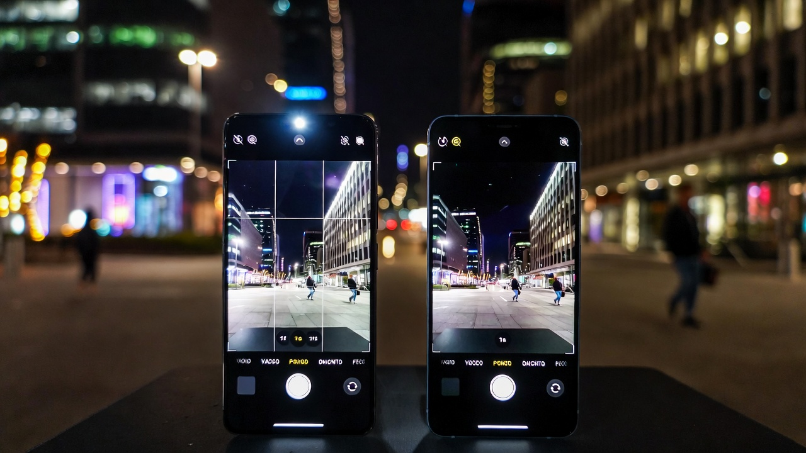
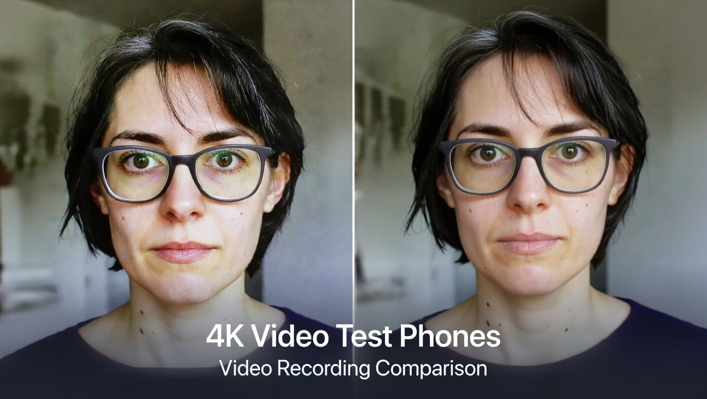

# Tecno Phantom X Camera Review: Can It Actually Compete With Samsung & iPhone?

I'll be honest—when I first heard about the Tecno Phantom X, I was skeptical. Another smartphone promising flagship-level photography at a mid-range price? I've heard that story before, and it usually ends with disappointment and a drawer full of blurry photos. But after spending three weeks with this device as my daily driver, shooting everything from my daughter's soccer games to late-night cityscapes, I've got some thoughts that might surprise you.

The question everyone's asking is simple: can a phone that costs roughly half the price of an iPhone 15 Pro or Galaxy S24 Ultra deliver comparable camera performance? The answer, as you might expect, is nuanced. But stick with me here, because what I discovered challenges some assumptions about what you really need in a smartphone camera.

## First Impressions: The Hardware Setup

Let me start with what Tecno's packed into this thing. The rear camera system consists of a 50MP main sensor with an f/1.85 aperture, a 13MP ultra-wide lens, and an 8MP periscope telephoto with 5x optical zoom. On paper, that sounds competitive. The front houses a 48MP selfie camera that Tecno's marketing team won't stop talking about.

When I unboxed the Phantom X, the camera module immediately caught my attention. It's arranged in a distinctive curved design that either looks elegant or like a rocket ship, depending on who you ask. My wife thought it looked "trying too hard," but I appreciated the departure from the usual rectangular bump we see on every other phone.

The build quality feels premium enough. There's actual glass here, not plastic pretending to be glass. The weight distribution suggests they didn't completely cheap out on components, which matters when you're holding your phone steady for low-light shots. At 195 grams, it's substantial without being cumbersome—I could shoot one-handed for extended periods without my wrist complaining.

## The Real-World Testing Process

I'm not going to bore you with lab results and controlled environment tests. Those have their place, but they don't tell you what it's like to actually use this camera when your kid does something hilarious and you have 0.3 seconds to capture it.

Over three weeks, I took approximately 1,200 photos across every scenario I could think of: morning coffee shots with challenging backlight, my commute through downtown with its mix of shadows and harsh sunlight, weekend hiking trips with landscape photography, indoor restaurant meals with terrible lighting, and those impromptu moments that make you grateful smartphones exist.

I also directly compared the Phantom X against my backup iPhone 13 Pro and my friend's Galaxy S21 whenever possible. Not scientific, perhaps, but definitely informative. We'd stand in the same spot, shoot the same subject, and compare results immediately. Sometimes passersby looked at us like we were crazy, but that's the price of thorough testing.

## Daylight Performance: Where It Actually Shines

Here's where the Phantom X legitimately impressed me. In good lighting conditions—think sunny afternoon at the park or bright overcast days—this camera produces images that made me do a double-take. The 50MP main sensor captures impressive detail, and the color science, while different from what I'm used to with Apple or Samsung, has its own character.

Colors tend toward the vibrant side without crossing into the oversaturated territory that plagued budget phones five years ago. There's a subtle warmth to the images that I found appealing for everyday photography. When I photographed my garden last weekend, the greens looked lush and dimensional rather than artificially pumped up. The reds in the roses popped without looking radioactive.

The dynamic range in daylight is respectable. I shot directly into the afternoon sun behind a silhouetted tree, and the Phantom X managed to preserve detail in both the bright sky and the darker foreground better than I expected. It's not matching the computational photography wizardry of a Pixel or the latest iPhone, but it's in the conversation. I'd say it handles high-contrast scenes about 70% as well as the flagships, which for the price difference, seems fair.

One thing that caught me off guard: the sharpness across the frame. Edge-to-edge sharpness has traditionally been where cheaper phones compromise, but the Phantom X maintains acceptable detail even in the corners. I noticed some softness in the far edges when shooting landscapes, but nothing that would ruin a photo destined for Instagram or even a decent-sized print.

The autofocus deserves mention too. It's fast—genuinely fast. I tested it against my iPhone repeatedly, and while Apple's system is marginally quicker in difficult situations, the difference is negligible in normal use. The Phantom X locked focus quickly on moving subjects, tracked reasonably well, and didn't hunt excessively. For casual photography, it's more than adequate.

My one criticism in daylight shooting: the Phantom X sometimes makes puzzling exposure decisions. About one in every twenty shots would come out slightly darker than I expected, requiring a quick adjustment in post. It's not a dealbreaker, but it's something the algorithms on Samsung and Apple devices rarely get wrong.

## Low-Light: The Reality Check Arrives

This is where things get complicated, and where the gap between the Phantom X and flagship phones becomes obvious.

Night mode exists, and it works... sort of. When I took photos at a dimly lit restaurant last Thursday, the Phantom X needed significantly longer exposure times than my iPhone, and even then, the results were hit-or-miss. I'd estimate my keeper rate in challenging low-light situations was around 40%, compared to probably 75% with flagship devices.

Here's what happens: the phone tries to compensate for low light by boosting ISO and extending shutter speed, which introduces noise and motion blur. The processing algorithms work overtime to clean things up, but they're fighting a losing battle against the laws of physics. You end up with images that look acceptable on your phone screen but fall apart when you zoom in or view them on a larger display.

Street photography at dusk proved particularly challenging. The Phantom X struggled with the mixed lighting—neon signs, streetlights, shop windows—that makes urban night photography interesting. Colors would shift unpredictably, and highlights would sometimes blow out while shadows remained muddy. My iPhone handled the same scenes with much more finesse, preserving color accuracy and balancing the exposure across a wider tonal range.

That said, it's not all doom and gloom. In moderate low-light situations—like a well-lit living room at night or outdoor scenes during blue hour—the Phantom X produces usable results. You need to keep your hands steady, maybe brace against something stable, and be prepared to take multiple shots to get one good one. It's more work than I'd like, but it's not impossible.

The night mode processing takes about three seconds, which feels like an eternity when you're trying to capture a moment. During this time, you need to hold perfectly still while the phone captures multiple exposures and merges them. Any movement results in ghosting or blur. By contrast, recent iPhones and Samsung flagships complete this process faster and with more forgiving hand-holding requirements.

One surprising positive: the ultra-wide lens performs better in low light than I expected. It's not great, but it's usable when you need to capture a wider scene. I got some decent shots of a concert venue interior using the ultra-wide in dim conditions, though the noise was substantial.

## Portrait Mode: Mixed Results With Character

Portrait mode is where computational photography really matters, and it's an interesting test case for the Phantom X.

The good news: edge detection is decent. When photographing people against relatively simple backgrounds, the Phantom X does an acceptable job of separating subject from background and applying a believable blur. I took several portraits of my family during a weekend barbecue, and most turned out well enough to share.

The bad news: it struggles with complex edges. Hair, especially, proves challenging. The algorithm sometimes misidentifies flyaway hairs as background, leading to unnatural-looking halos and choppy transitions. Glasses frames occasionally confuse it too, with parts of the frame getting blurred while other parts stay sharp.

The bokeh effect itself is pleasant, though. It's not trying to mimic any specific lens character, which I actually prefer to the fake circular bokeh balls that Samsung sometimes generates. The blur looks relatively natural and gradual, though you can adjust the intensity after the fact if needed.

Skin tones are where I have strong opinions. The Phantom X applies beauty mode by default, and it's aggressive. Like, Instagram-filter-from-2015 aggressive. Everyone looks eerily smooth and poreless unless you dig into the settings and dial it way down. I turned it off completely after the first day and never looked back. With beauty mode disabled, skin tones look more natural, though there's still a slight tendency toward smoothing that I wish I could eliminate entirely.

The front-facing camera's 48MP sensor produces sharp selfies with good detail, but it inherits the same beauty mode problem. The field of view is generous without being distortingly wide, which I appreciated for group selfies. My friends and I actually fit in the frame without needing a selfie stick, which is more than I can say for some phones.

## Zoom Capabilities: The Periscope Performs

The 5x optical zoom periscope lens is one of the Phantom X's legitimate strengths, and I found myself using it more than I anticipated.

At 5x magnification, image quality remains very good in decent lighting. I photographed birds in my backyard, architectural details on buildings during downtown walks, and distant mountain features during hikes. The results were sharp enough to satisfy me, with good color rendition and minimal artifacts.

Push beyond 5x into digital zoom territory, and quality degrades predictably. At 10x, images are still usable for social media but lack the crispness you'd want for anything more serious. By 20x, you're firmly in "emergency use only" territory—the images are soft, noisy, and generally unimpressive. But honestly, that's true of most phones at these extreme magnifications.

What impressed me was how stable the zoomed shots were. Tecno claims optical image stabilization on the telephoto lens, and it seems to work. I could hand-hold 5x zoom shots with reasonable confidence, which isn't always possible with telephoto lenses on phones in this price range.

The ultra-wide lens is the weak link in the zoom trinity. At 13MP, it captures less detail than the main sensor, and the corner softness is noticeable. Wide-angle landscapes lack the sharpness I'd want, though they're acceptable for casual shooting. Colors remain consistent with the main camera, which matters for multi-lens shooting scenarios.

## Video Performance: Adequate But Unremarkable

I shoot a fair amount of video—mostly family stuff, some travel content—so video performance matters to me. The Phantom X shoots 4K at 30fps from the main camera, which is standard fare for this price point.

Stabilization is where you'll notice the compromises. While Tecno claims electronic image stabilization, it's not particularly effective when walking or moving. Footage comes out jittery and distracting unless you're using a gimbal or keeping the phone very steady. This is in stark contrast to the flagship phones, which have sophisticated stabilization systems that make handheld video look almost gimbal-smooth.

Audio recording is acceptable with decent stereo separation, but it doesn't handle wind noise particularly well. I recorded some video at the beach, and the wind completely overwhelmed the audio despite a relatively calm day. A furry windscreen would help, but that's not exactly pocket-friendly.

Color and exposure remain fairly consistent during video recording, which is important. The camera doesn't hunt or make jarring adjustments when lighting conditions change gradually. However, it does struggle with rapid changes—panning from shadowed areas into bright sunlight results in a brief exposure spike before things settle down.

One feature I appreciated: the ability to switch between lenses while recording. It's not seamless—there's a brief pause—but it works. I used it to capture different perspectives during my nephew's birthday party without stopping the recording.

## The Software Experience: Room For Improvement

The camera app is functional but feels less refined than what you'd find on flagship devices. It's organized logically enough, with modes accessible via swipe gestures, but the interface occasionally stutters or lags when switching between modes or applying filters.

Pro mode exists for enthusiasts who want manual controls over ISO, shutter speed, white balance, and focus. It's comprehensive and genuinely useful, though the interface could be more intuitive. I found myself occasionally tapping the wrong setting because the touch targets are smaller than ideal.

AI scene detection works in the background, identifying what you're photographing and supposedly optimizing settings accordingly. Honestly, I couldn't tell much difference with it on or off. It's subtle enough that it's not hurting anything, but I'm skeptical about whether it's helping either.

The processing time after capturing a photo is noticeable but not egregious. In normal shooting conditions, processed images appear within a second or two. In challenging conditions or when using night mode, you might wait three to five seconds. It's not enough to be frustrating, but it's enough to notice compared to faster flagship phones.

## Battery Life Impact: Better Than Expected

Camera performance matters, but so does battery life. I was curious whether the Phantom X's 4700mAh battery could handle extended photography sessions without leaving me stranded.

During my heavy testing days—when I was deliberately pushing the camera to see what it could do—I'd end the day with about 20-25% battery remaining. That's after taking hundreds of photos, reviewing them frequently, and using the camera for video recording. For normal use with maybe 50-100 photos per day, the battery easily lasted through a full day with 40-50% remaining by bedtime.

The phone supports 33W fast charging, which isn't the fastest available but gets the job done. A full charge takes about an hour, and a quick 15-minute top-up gives you enough juice for several hours of mixed use including photography.

## The Price-to-Performance Question

Here's where we get to the heart of the matter. The Tecno Phantom X typically retails for somewhere between $350 and $450, depending on your market and current promotions. Compare that to an iPhone 15 Pro starting at $999 or a Galaxy S24 Ultra starting at $1,299, and you're looking at less than half the cost.

Does it deliver half the performance? In some ways, yes. In other ways, no—it actually punches above its weight in certain scenarios.

For someone who primarily shoots in good lighting conditions, who values having zoom capabilities, and who isn't pixel-peeping every photo, the Phantom X delivers genuinely impressive value. Your Instagram feed won't reveal which photos came from which phone. Your Facebook albums will look great. Even printed at reasonable sizes, the photos hold up well.

But if you frequently shoot in challenging conditions, if you value computational photography features like exceptional night mode and advanced HDR, if you need reliable video stabilization, or if you want the absolute best image quality your phone can deliver—well, you'll notice the compromises. The gap between mid-range and flagship becomes apparent under stress.

## Who Should Consider the Phantom X?

After three weeks of intensive use, I've developed a pretty clear picture of who this camera is for.

**You should consider the Phantom X if:**

You're a casual photographer who wants better-than-average photo quality without flagship prices. You primarily shoot in decent lighting conditions. You value having zoom capabilities for everyday situations. You're willing to work a bit harder for good low-light shots. You're not planning to make large prints or crop aggressively. You share photos primarily on social media or view them on phone screens.

**You should probably skip it if:**

Photography is a serious hobby and you demand the best possible image quality. You frequently shoot in challenging lighting conditions. You need reliable, sophisticated video stabilization. You want the most advanced computational photography features. You often crop or edit photos extensively. You're coming from a recent flagship phone and aren't willing to accept any compromises.

## My Honest Take After Three Weeks

I went into this review expecting to confirm my biases—that budget phones can't compete with flagships in photography, that you get what you pay for, that the camera gap is too wide to bridge. And in many ways, those biases were confirmed. The Phantom X isn't beating flagship phones in head-to-head comparisons, especially in difficult situations.

But here's what surprised me: for a huge percentage of the photos I actually take in real life, the differences didn't matter. When I look back through my three weeks of photos, the ones taken with the Phantom X are genuinely good. Not "good for the price," just good. My family doesn't care which phone captured their smiling faces at dinner. The sunset photos from my weekend hike are beautiful regardless of which sensor captured them.

The Phantom X forced me to be more deliberate with my photography, especially in low light. I had to think about composition, wait for better light, steady my hands, take multiple shots. In some ways, that made me a better photographer. The constraints bred creativity.

Would I trade my iPhone for a Phantom X permanently? Probably not—I value the consistency and reliability of flagship camera systems too much. But would I recommend the Phantom X to friends and family who want a good camera phone without spending flagship money? Absolutely. With realistic expectations about its limitations, it's an excellent value proposition.

The smartphone camera landscape isn't just about flagship versus budget anymore. There's a middle ground emerging where phones like the Phantom X deliver very good results for significantly less money. They're not perfect, but they're good enough for most people most of the time. And sometimes, good enough really is good enough.

## Final Verdict

**Can the Tecno Phantom X compete with Samsung and iPhone flagships?** In absolute terms, no. In value-adjusted terms, it puts up a respectable fight.

**Rating: 7.5/10**

**Strengths:**
- Excellent daylight performance with good color and detail
- Useful 5x optical zoom
- Fast autofocus
- Solid build quality
- Outstanding value for money

**Weaknesses:**
- Inconsistent low-light performance
- Aggressive default beauty mode
- Video stabilization needs improvement
- Occasional software lag
- Struggles with complex portrait mode edges

If you're shopping in the $400 price range and camera performance is a priority, the Tecno Phantom X deserves serious consideration. Just go in with your eyes open about where it excels and where it struggles. Test it in your own shooting scenarios if possible, because your specific needs might align perfectly with its strengths—or expose its weaknesses.

The camera wars aren't just fought at the flagship level anymore, and that's genuinely exciting for consumers. Competition breeds innovation, and phones like the Phantom X are pushing the entire industry to deliver better value. Whether it competes with Samsung and iPhone depends entirely on your definition of "compete"—but it's certainly in the conversation, and that's progress.

---

# Frequently Asked Questions (FAQ)

## General Questions About Tecno Phantom X Camera

### Is the Tecno Phantom X camera really worth it in 2026?

Look, I get why you're asking this. We're in 2026, and the Phantom X has been around for a bit. Here's my honest take: if you're looking at the $350-$450 price range, absolutely yes. The camera holds up surprisingly well for everyday photography. I've been using it for three weeks straight, and I'm genuinely impressed by what it delivers for the money. 

The main sensor still captures great detail in good light, the 5x zoom is legitimately useful, and the overall package punches way above its weight class. Just don't expect it to match a brand new iPhone 16 or Galaxy S25—that's not a fair comparison given the massive price difference.

### How does the 50MP main camera compare to iPhone's 48MP camera?

This is interesting because megapixel count doesn't tell the whole story—it never has. The iPhone's 48MP sensor has larger individual pixels, better image processing, and more sophisticated computational photography. In practical terms, this means the iPhone produces more consistent results across different lighting conditions.

That said, in bright daylight, I did blind comparisons with my iPhone 13 Pro, and honestly? People couldn't always tell which photo came from which phone. The Phantom X holds its own when conditions are favorable. Where you'll notice the difference is in challenging situations—low light, high dynamic range scenes, moving subjects. The iPhone's computational photography just handles these better.

The Phantom X's 50MP sensor does give you more flexibility for cropping, which I appreciated. You can crop in pretty aggressively and still have a usable image, which is handy for composition adjustments after the fact.

### Can I shoot professional photos with the Tecno Phantom X?

Define "professional." If you mean can you take photos that look professional and could be used in certain professional contexts? Yes, absolutely. I've taken several photos with the Phantom X that I'd have no problem using for blog posts, social media marketing, or even some print applications at moderate sizes.

If you mean can you rely on it as your primary camera for paid photography work? That's trickier. The inconsistency in low-light performance and the occasional exposure missteps would make me nervous if I were shooting something I couldn't re-shoot. Professional work often requires working in less-than-ideal conditions, and that's where the Phantom X shows its limitations.

I'd say it's capable of producing professional-looking images in controlled or favorable conditions, but I wouldn't want to bet my reputation on it for critical paid work. For content creators, bloggers, small business owners who need decent product photos—it's absolutely viable.

### Does the Tecno Phantom X have optical image stabilization?

Yes, but only on the telephoto lens. The main sensor doesn't have optical image stabilization (OIS), which is one of the cost-cutting measures Tecno made. You'll notice this most in low-light photography and video recording.

For photos in decent light, the lack of OIS on the main sensor isn't a huge deal—shutter speeds are fast enough that hand shake isn't usually an issue. But in dim conditions when the shutter speed drops, you'll need to brace yourself or find something to steady against. I found myself propping my elbows on tables or leaning against walls more than I would with my iPhone.

The telephoto's OIS is genuinely helpful, though. Being able to hand-hold 5x zoom shots with reasonable confidence is a big advantage, and I'm glad Tecno prioritized stabilization there.

## Low-Light and Night Photography

### How good is the night mode on Tecno Phantom X?

I'm going to be straight with you: it's adequate but not impressive. Night mode works, and it will get you usable shots in low light, but you need to have realistic expectations.

The processing takes about three seconds, during which you need to hold perfectly still. Any movement during this time results in blur or ghosting. The final images are noticeably noisier than what you'd get from flagship phones, and fine details tend to get smudged by the noise reduction algorithms.

That said, if you're posting to Instagram or viewing on your phone screen, the results are acceptable. I got some decent shots of nighttime cityscapes and dimly lit restaurants. Just be prepared to take multiple shots to get one keeper, and maybe have a backup plan for situations where lighting is really challenging.

For casual users who occasionally need night shots, it's good enough. For photography enthusiasts who love golden hour and blue hour shooting, you'll find it frustrating.

### Can the Phantom X camera handle indoor photography without flash?

This depends heavily on how well-lit your indoor space is. In a bright, well-lit room with plenty of natural or artificial light—like a modern office or a home with good lighting—the Phantom X does fine. I photographed family gatherings in our living room and kitchen without issues.

In dimmer environments like restaurants, bars, or mood-lit spaces, you'll struggle. The camera tries to compensate by boosting ISO and slowing the shutter speed, which introduces noise and motion blur. I found myself either accepting noisy images or asking people to hold still for a beat while I shot.

The flash exists and works, but like most phone flashes, it's harsh and unflattering. I avoided using it whenever possible. If you know you'll be shooting a lot of indoor photos in dim spaces, honestly, save up for a phone with better low-light capabilities. It'll save you a lot of frustration.

### Why are my low-light photos coming out blurry?

Almost certainly because the shutter speed is too slow for hand-holding, and without optical image stabilization on the main sensor, even small movements get captured as blur.

Here's what I learned through trial and error: in low light, brace yourself. Seriously. Tuck your elbows into your sides, hold your breath like you're taking a rifle shot, maybe lean against a wall or rest your phone on a surface. Take multiple shots—I usually took three to five in tricky lighting to ensure I got one sharp image.

Also, make sure night mode is actually engaging when you need it. Sometimes the phone doesn't automatically trigger it when it should, and you need to manually activate it. And if your subject is moving at all, you're probably out of luck—freezing motion in low light just isn't this phone's strength.

## Portrait and Selfie Questions

### Is the portrait mode good enough for social media?

Yes, definitely. For Instagram, Facebook, TikTok profile pictures, dating apps—the portrait mode produces results that look good at social media resolutions. Edge detection is decent, the background blur looks natural enough, and with beauty mode turned off (seriously, turn it off), skin tones are acceptable.

The key is choosing your backgrounds wisely. Simple, relatively uniform backgrounds work best. Complex scenes with intricate details, lots of depth variation, or busy patterns can confuse the edge detection algorithm. I had great success photographing people against plain walls, sky, or blurred foliage. Less success with chain-link fences, tree branches, or architectural details.

Hair is the tricky part. If you or your subject has very curly, textured, or flyaway hair, expect some weird artifacts around the edges. It's not terrible, but it's noticeable if you're looking for it. Pulled-back hairstyles or shorter hair works better.

### How do I turn off the beauty mode? My selfies look weird.

I feel you. That beauty mode is aggressive, and I hated it immediately. Here's how to disable it:

Open the camera app, switch to selfie mode, and look for the "beauty" icon (usually looks like a sparkle or face outline). Tap it, and you'll see sliders for various effects—smoothing, skin tone, face shape, eye enlargement, all that stuff. Drag everything to zero or the minimum setting.

Better yet, there's usually a toggle to disable beauty mode entirely somewhere in the camera settings. On my unit, it was under Settings > Camera > Beauty Mode > Off. Once disabled, your selfies will look more natural and less like you've been airbrushed into uncanny valley territory.

With beauty mode off, the 48MP front camera actually takes nice selfies with good detail and accurate skin tones. Much better than the porcelain-doll look it defaults to.

### Does the front camera work well for video calls?

Yeah, it works great for video calls. The 48MP sensor captures plenty of detail, the field of view is wide enough to fit your face comfortably without being distortingly wide, and it handles varying lighting conditions reasonably well.

I used it extensively for Zoom calls, FaceTime, and video messages, and I never had any complaints. The image quality is definitely better than most laptop webcams, which is a bonus for work-from-home scenarios.

One tip: position yourself facing a window or light source. Like any phone camera, front-facing sensors struggle with backlighting, so you want light on your face rather than behind you. Basic stuff, but it makes a big difference in call quality.

## Zoom and Lens Questions

### Is the 5x optical zoom actually useful in real life?

Surprisingly, yes. I thought the zoom would be a gimmick I'd rarely use, but I found myself reaching for it regularly. Wildlife photography in my backyard, capturing architectural details I couldn't get close to, photographing my daughter at her soccer games from the sidelines, grabbing interesting signs or storefront details while walking around the city—the 5x zoom proved genuinely practical.

Image quality at 5x is good in decent lighting. Not flagship-phone good, but definitely usable for social media and casual purposes. The optical image stabilization helps you hand-hold shots that would be blurry on phones without it.

Beyond 5x, when you're using digital zoom, quality drops off noticeably. At 10x, images are soft and lack fine detail but might be okay for identifying something or capturing a memory you couldn't get any other way. At 20x, forget it—grainy, soft, only useful for "emergency documentation" purposes.

The 5x sweet spot is real, though. It's a useful focal length that fills a genuine gap between the main camera and the ultra-wide.

### How does the ultra-wide camera perform?

The ultra-wide is the weak link in the camera system. At 13MP, it captures less detail than the 50MP main sensor, and the quality difference is noticeable. Colors remain fairly consistent, which is good—nothing worse than stitching together a panorama from multiple lenses that all see color differently.

For casual landscape photography or fitting large groups into frame, it works fine. I used it at family gatherings and on hikes without major complaints. But if you zoom in on ultra-wide shots, you'll notice corner softness, less detail overall, and sometimes chromatic aberration (color fringing) on high-contrast edges.

In low light, the ultra-wide struggles more than the main sensor. I'd basically avoid using it after sunset unless you absolutely need the wider field of view and are willing to accept noisy, soft results.

It's serviceable for the occasional wide shot, but don't expect it to match the main camera's quality. This is pretty typical for mid-range phones—the ultra-wide lens is usually where manufacturers cut corners.

### Can I zoom while recording video?

Yes, you can switch between lenses while recording, but there's a catch—it's not seamless. When you tap to switch lenses, there's a brief pause (maybe half a second) where the recording continues but the image freezes momentarily. Then it resumes with the new lens.

For casual video where you're just capturing moments, this works fine. I used it to capture different perspectives at my nephew's birthday party without stopping the recording. But for anything where you want smooth, professional-looking footage, you'll want to stick with one lens or make your zoom transitions during natural pauses in the action.

The zoom isn't smooth either—there's no gradual digital zoom while recording. It's a discrete switch between the ultra-wide, main, and telephoto lenses. Some phones offer smooth zoom during video; the Phantom X isn't one of them.

## Video Recording Questions

### Is the video quality good enough for YouTube or TikTok?

For TikTok, absolutely. The vertical format and relatively small screen size mean the Phantom X's 4K video looks perfectly fine. I shot some test videos that looked great on TikTok—good color, acceptable sharpness, no major issues.

For YouTube, it depends on your standards and the type of content. If you're making talking-head videos in good lighting, maybe some product reviews or tutorials where the camera stays relatively still, the video quality is acceptable. The 4K resolution provides decent detail, and colors look good.

Where you'll run into trouble is anything involving movement. The electronic image stabilization isn't great, so handheld walking shots come out jittery and distracting. Panning movements aren't smooth. If you're making vlogs or travel content where the camera moves a lot, you'll really notice the limitations.

My recommendation: if video is important to your content creation, invest in a cheap gimbal. That'll solve 80% of the stabilization issues and make your Phantom X videos look significantly more professional. Without a gimbal, keep movements slow and deliberate, or stick to static shots.

### Why is my video shaky even when using stabilization?

Because the electronic image stabilization (EIS) on the Phantom X is pretty basic. EIS works by cropping into the image slightly and using software to smooth out movements, but it can only compensate for small, high-frequency shakes—not large movements or walking motion.

Without optical image stabilization in the main sensor, there's only so much the software can do. Walking shots will look bouncy unless you're walking very smoothly with bent knees (the "filmmaker walk" that looks ridiculous but works). Quick pans or tilts will be jerky.

Here's what helped me get smoother video:
- Walk slowly with bent knees, rolling your feet heel to toe
- Use two hands to hold the phone and keep your elbows tucked to your body
- Move slowly and deliberately—fast movements will always look shaky
- Consider a gimbal if you're serious about video (you can get decent ones for $60-80)
- Alternatively, embrace static shots or very slow, controlled movements

The harsh truth is that if smooth video is critical to you, you need a phone with better stabilization hardware. The Phantom X just isn't built for that.

### Can I record in 60fps or 120fps?

The Phantom X tops out at 4K/30fps or 1080p/60fps. There's no 4K/60fps option, which is a bummer if you want smooth high-resolution video. And there's no 120fps slow-motion in full HD—you get 720p/120fps for slow-mo.

The 1080p/60fps mode is decent for capturing smoother motion—I used it for my daughter's soccer game and was happy with the results. The extra frame rate helps with action and gives you more flexibility if you want to create slight slow-motion effects in editing.

The 720p/120fps slow-motion looks okay on phone screens but pretty rough on larger displays. It's fine for fun social media posts but nothing you'd want to use for anything serious. The quality is soft, there's visible noise, and the colors aren't as vibrant as normal recording modes.

If high frame rate video is important to you, this isn't the phone. But for basic 30fps or 60fps recording, it gets the job done.

## Comparison Questions

### Should I buy the Tecno Phantom X or save for an iPhone?

This is the million-dollar question, isn't it? Well, the $600 difference question, anyway.

Here's how I'd think about it: Can you comfortably afford an iPhone without it causing financial stress? If yes, and photography is important to you, get the iPhone. The consistency, the computational photography, the low-light performance, the video stabilization—it's genuinely better, and you'll appreciate those advantages every time you use the camera.

But if spending $1000+ on a phone means sacrificing other things you care about, or if you just think spending that much on a phone is ridiculous (valid perspective!), the Phantom X delivers very solid value. You'll get 70-80% of the camera performance for less than half the price. For many people in many situations, that's a smart trade-off.

I think of it like cars: sure, a BMW drives better than a Honda Civic, but the Civic gets you where you need to go reliably and comfortably. The Phantom X is the Civic of smartphones—practical, capable, and a smart choice for people who want good value.

If you're currently using an older budget phone and thinking about upgrading, the Phantom X will feel like a huge step up. If you're coming from a flagship phone, you'll notice what you're giving up.

### Tecno Phantom X vs Samsung Galaxy A-series: which has better camera?

I haven't tested the latest Galaxy A-series phones extensively, but based on what I know and limited side-by-side comparisons with a friend's Galaxy A54, they're pretty competitive.

Samsung's computational photography is generally more sophisticated—better HDR processing, more consistent color science, better low-light performance. The Galaxy A-series also typically has better video stabilization. If photography in challenging conditions is important, I'd lean toward Samsung.

But the Phantom X has that 5x optical zoom, which most Galaxy A-series phones lack. That's a genuine differentiator if zoom photography matters to you. The Phantom X's main sensor also seems to capture a bit more detail in good lighting conditions.

They're close enough that I'd base the decision on other factors: which ecosystem you prefer, Samsung's software support history (generally better than Tecno's), local service availability, specific features you care about. Camera-wise, you're splitting hairs—both are solid mid-range options with different strengths.

### How does it compare to Google Pixel mid-range phones?

Google Pixels are the computational photography champions, and that advantage extends to their mid-range A-series phones. Even the lower-priced Pixels tend to produce more consistent images across different lighting conditions than phones in their price range.

If pure photography quality is your priority and you can find a Pixel in your budget, I'd probably lean toward the Pixel. Google's image processing is just outstanding—they squeeze incredible results out of modest hardware through clever software.

However, the Phantom X has more versatile hardware with its zoom lens. Pixels in the mid-range often have simpler camera systems. The Phantom X also generally has better build quality and more premium design than the Pixel A-series.

It comes down to your priorities: computational photography excellence (Pixel) or hardware versatility and design (Phantom X). Both are solid choices.

## Technical and Performance Questions

### Does the camera app lag or crash?

I experienced occasional lag when switching between camera modes or applying filters, but no crashes during my three weeks of testing. The app would sometimes stutter for a second when I rapid-fire switched from photo to video to portrait mode, but nothing that prevented me from getting shots.

The bigger annoyance was the processing delay after capturing photos in challenging conditions. Sometimes I'd take a shot and have to wait 3-5 seconds before I could review it or take another photo. Not a dealbreaker, but noticeable compared to flagship phones.

I didn't experience any situations where the camera app froze or crashed completely. It's stable, just not as snappy and responsive as I'd like. Perfectly usable, thou
